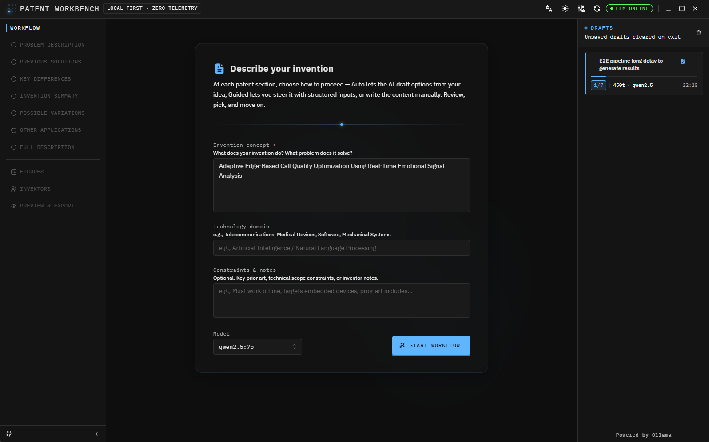

<div align="center">
  
  <h1>Patent Workbench</h1>
  <p>Local LLM Assistant for Patent Ideation</p>

  
  
  
</div>

---

### Turn ideas into structured, patent-ready artifacts — powered by AI

Design, validate and refine invention concepts in a unified workspace built for engineers, innovators and patent thinkers.

<p align="center">
  
</p>

<p align="center">
  <em>A structured invention IDE powered by local LLMs</em>
</p>

---

## Table of Contents

<div>

| Section | Description |
| --- | --- |
| [What it does](#what-it-does) | Platform overview and workflow explanation |
| [Workflow](#workflow) | End-to-end drafting pipeline |
| [Key features](#key-features) | Core platform capabilities |
| [Supported languages](#supported-languages) | UI localization support |
| [Architecture](#architecture) | System design and structure |
| [Prerequisites](#prerequisites) | Requirements to run locally |
| [Ollama setup](#ollama-setup) | Local LLM configuration |
| [Getting started](#getting-started) | Run the application |
| [Available scripts](#available-scripts) | Development utilities |
| [Contributing](#contributing) | Contribution guidelines |
| [Licensing](#licensing) | License model |
| [Contact](#contact) | Maintainer contact info |

</div>

---

## What it does

Patent Workbench guides inventors through a structured five-phase workflow, composed of seven core drafting steps that produce a complete patent application draft. Each step uses a dedicated prompt template built on the REG (Role + Examples + Goal) pattern, instructing the model to reason like a USPTO patent analyst or attorney and generate output aligned with standard IDF language conventions.

In addition to the core workflow, three supporting steps are included: figure creation (step 08), inventor and naming details (step 09), and final preview and export (step 10).

At every step the LLM generates **three distinct options** to compare. You pick the one that best fits your intent — or regenerate — before the workflow advances automatically.

Context from earlier steps and any uploaded reference documents is injected into subsequent prompts via a **RAG** (Retrieval-Augmented Generation) mechanism, so later sections remain coherent with earlier ones without requiring the user to re-explain the invention.

---

## Workflow

### Phases

```text
input → working (steps 1–7) → figures → inventors → preview / export
```

| Phase | Description |
| --- | --- |
| **input** | Enter invention idea, technical domain, optional constraints, and optional reference documents (context files) |
| **working** | Step through the seven IDF modules; pick Auto, Guided, or Manual mode for each |
| **figures** | Create flowcharts with the built-in diagram editor, upload images, or attach structured JSON diagrams; add captions |
| **inventors** | Add inventor details (name, address, citizenship, employee ID, etc.) and optional patent metadata (IDF number, business group) |
| **preview** | Review the fully assembled artifact, edit any section inline, and export as `.md` or `.docx` |

### Seven drafting steps

| # | Step | IDF Section | Est. tokens |
| --- | --- | --- | --- |
| 1 | Problem Description | Why the invention was needed; business/technical pain | ~650 |
| 2 | Previous Solutions | Existing approaches and their limitations | ~1000 |
| 3 | Key Differences | Novel elements vs. prior art; the inventive step | ~1200 |
| 4 | Invention Summary | High-level overview + key technologies + market context | ~1100 |
| 5 | Possible Variations | Alternative embodiments to broaden patent scope | ~1200 |
| 6 | Other Applications | Domain transfer and additional use cases | ~1150 |
| 7 | Full Description | Complete technical description enabling PHOSITA | ~2500 |

### Input modes (per step)

| Mode | Behaviour |
| --- | --- |
| **Auto** | Prompt is assembled automatically from the base idea, prior sections, and context files |
| **Guided** | User fills structured form fields; fields are interpolated into the template before sending to the LLM |
| **Manual** | User writes the section content directly; no LLM call is made |

> [!NOTE]
> An average creation using the "guided" method takes about: **~8 800 tokens**.

---

## Key features

- **Three-option selection** — every generation returns three distinct options to compare side-by-side.
- **Context files (RAG)** — attach reference documents (`.txt`, `.md`, `.csv`, `.json`, etc.) at the start; content is injected into prompts up to a 40 000-character budget.
- **Model selector** — switch between any Ollama-compatible model (Mistral, Llama 3, Phi-3, Gemma 2, etc.).
- **Model context length** — automatically fetches the `num_ctx` value from the model's Modelfile and shows it in the UI; context file upload is conditionally enabled for models with ≥ 16 384 tokens.
- **Settings panel** — persistent runtime configuration accessible from the header: default model, options per step (1–5), LLM timeout, max prompt length, Ollama URL, server log level, and shutdown timeout; saved to the server and restored on every app boot.
- **Token meter** — live prompt + completion token counts per step, totalled across the session.
- **LLM status indicator** — real-time connectivity check with latency; polls every 30 seconds.
- **Persistent sessions** — sessions are saved to a local SQLite database and survive page reload and browser restart; browse, restore, or delete from the Drafts sidebar.
- **Diagram editor** — in-app flowchart creator (`@xyflow/react`); exports as PNG for embedding in figures.
- **Export** — save as `.txt`, `.pdf` (print dialog), or `.docx` (Word document with embedded figures and inventors block).
- **Prompt injection protection** — server-side detection and rejection of jailbreak/override patterns.
- **Cancellation** — abort an in-progress generation at any time via AbortController.
- **Dark / light mode** and **resizable split view** (input + options on the left, live preview on the right).

---

## Supported languages

The UI is fully translated into 16 locales:

| English | European Languages | Nordic | Other |
| --- | --- | --- | --- |
| `en-US`, `en-GB` | `de-DE`, `es-ES`, `es-CL`, `fr-FR`, `fr-CA`, `it-IT`, `nl`, `pt-PT`, `pt-BR` | `nb-NO`, `sv-SE` | `cy-GB`, `ru-RU`, `zh-CN` |

<br/>

### Inputting invention content in a non-English language

> [!IMPORTANT]  
> The UI language and the **invention content language** are independent settings. Switching the locale translates all labels, buttons, and tooltips but does **not** change the language the REG algorithm prompts in.

The REG system contexts are authored in English and instruct the model to reason as a USPTO patent analyst. They are defined in `client/src/config/reg-templates.json` — the primary customisation entry point — and mirrored as defaults in `client/src/utils/workflowTemplates.ts`. If you want the LLM to generate patent sections in another language, edit `reg-templates.json` without touching application code: append an explicit instruction such as `"Respond entirely in Portuguese."` to each `systemContexts` string. See [docs/customising-reg-templates.md](docs/customising-reg-templates.md) for a full authoring guide.

Until the REG prompts are adapted, submitting the invention idea in a non-English language will work, but the generated options are likely to be returned in English regardless of the UI locale.

---

## Architecture

```text
patent-workbench/
├── client/          # React 18 + Vite + Mantine v7 + Tailwind CSS v4 frontend
├── server/          # Express + TypeScript API (LLM proxy + validation + SQLite persistence)
├── docs/            # Algorithm and architecture documentation
└── scripts/         # Setup and build utilities
```

The client talks exclusively to the Express backend via a typed API layer (`client/src/api/client.ts`). The server validates, sanitizes, and forwards requests to Ollama running on `localhost:11434`. **The LLM never receives requests directly from the browser.**

Session data (artifact content, figures, inventor details, diagram board state) is persisted in a SQLite database at `<DATA_DIR>/workbench.db` (default: `./data/workbench.db` relative to the server working directory). Figures are stored in a normalised `figures` table; the rest of the artifact is stored as JSON. The database uses WAL mode for safe concurrent access.

All prompt assembly — including REG system contexts, RAG context injection, and option-format enforcement — happens in the client before the request is sent to the server. The server is responsible for security, rate limiting, and transport; the client owns the prompt strategy.

---

## Prerequisites

> [!NOTE]  
> - Node.js 20+
> - [Ollama](https://ollama.com) installed and running locally.
> - At least one model pulled, e.g. `ollama pull mistral`

---

## Ollama setup

> [!CAUTION]
> ### Keep Ollama local
> Ollama must run exclusively on localhost. Never expose it to the network while using Patent Workbench, as prompts contain confidential invention disclosures.

In the **Ollama desktop app settings**, ensure the following are **disabled**:

| Setting | Why |
| --- | --- |
| **Expose Ollama to the network** | Keeps the API bound to `127.0.0.1` only |
| **Cloud** | Prevents any telemetry or prompt data leaving the machine |
| **Auto-download models** | Prevents silent model pulls in response to API requests |

### Context length recommendations

| Available RAM | Recommended `num_ctx` | Notes |
| --- | --- | --- |
| 16 GB | 4 096 | Minimum viable; may truncate on the final steps for large prompts |
| 32 GB | 8 192 – 16 384 | Ideal for most workflows |
| 64 GB+ | > 16 384 | For very large models or context-heavy reference documents |

> [!TIP] 
> - Apply via Ollama app settings.
> - Each full workflow run accumulates ~8 800 tokens of context.

---

## Getting started

```bash
# Install all dependencies (client + server)
npm run setup

# Start both dev servers concurrently
npm start
```

Or run them separately:

```bash
npm run server:dev   # Express on localhost:3001 (watch mode)
npm run client       # Vite on localhost:3003/patent-workbench
```

> [!TIP] 
> Open `http://localhost:3003/patent-workbench`. The status badge in the header turns green once Ollama is reachable.

---

## Available scripts

| Script | Description |
| --- | --- |
| `npm run setup` | Install all dependencies for both workspaces |
| `npm start` | Generate i18n files, then run client and server concurrently |
| `npm run server:dev` | Server in watch mode on `:3001` |
| `npm run client` | Vite dev server on `:3003` |
| `npm run client:build` | Build client to `client/dist/` |
| `npm run lint` | ESLint + Markdown + StyleLint |
| `npm run audit:check` | Run `npm audit` at moderate severity level |
| `npm run clean` | Remove build artifacts and caches |
| `npm run generate:favicons` | Regenerate favicon assets from source SVG |
| `npm run i18n:generate` | Regenerate i18n translation files |

> [!NOTE] 
> - For server-specific configuration (env vars, endpoints, rate limits) see [server/README.md](server/README.md).
> - For client architecture and component details see [client/README.md](client/README.md).
> - For algorithm documentation see [docs/reg-rag-algorithms.md](docs/reg-rag-algorithms.md).

---

## Contributing

- Open focused, small PRs.
- Run `npm run lint` and `npm run format` before submitting.
- See [CONTRIBUTING.md](CONTRIBUTING.md) for full guidelines.

---

## Licensing

This project uses a split-licensing model:

- **Open-source (Apache-2.0)** — all UI components, the React/Vite setup, generic workflow template structures, utilities, types, API layer, and tooling. See [LICENSE](LICENSE) and [NOTICE](NOTICE).
- **Proprietary (Commercial EULA)** — the REG algorithm's specific system-context strings and enterprise/company-branded templates are proprietary and are not published in this repository. Those artifacts are licensed separately. See [EULA_PROPRIETARY.md](EULA_PROPRIETARY.md).

If you plan to contribute code that depends on proprietary artifacts, open an issue first so the separation remains clean and public contributions stay license-compatible.

For on-premise enterprise licenses, POC access, or private builds that include the REG algorithm and enterprise templates, contact the maintainers.

---

<br/>
<div id="contact" align="center">

[](https://www.linkedin.com/in/jhonatan-saints/)&nbsp;&nbsp;[](mailto:jhonatan.santos@mitel.com)&nbsp;&nbsp;[](https://x.com/dev4Dcoin)

</div>
<br/>

<p align="center">
  
</p>